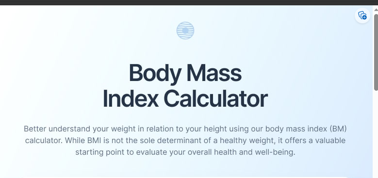

<h1 aling="center">
   
</h1>   

## 💻 Sobre o Projeto

   🩺 A Calculadora de Índice de Massa Corporal é uma forma de identificar             problemas de obesidade ou desnutrição, em crianças, adolescentes, adultos e idosos.
    
    
   
## Nesta página web os usuários poderão:

  📍 Calcular o seu índice de massa corporal  
  📍 Receberão a classificação  de Magreza | Normal | Sobrepeso | Obesidade grau 1 |Obesidade grau 2 | Obesidade grau 3 |   
  📍 Recomendações de exercícios | alimentação e sono de qualidade  
   

## Requisitos funcionais:
   🛠 Incluir | alterar iinformações  
   🛠 Tela de alteração de feminino a masculino  
   🛠 Consulta do IMC  
   
     
    
<h4 align="center"> 
	🚧 Calculadora de Índice de Massa Corporal  🚀 em construção... 🚧
</h4>

